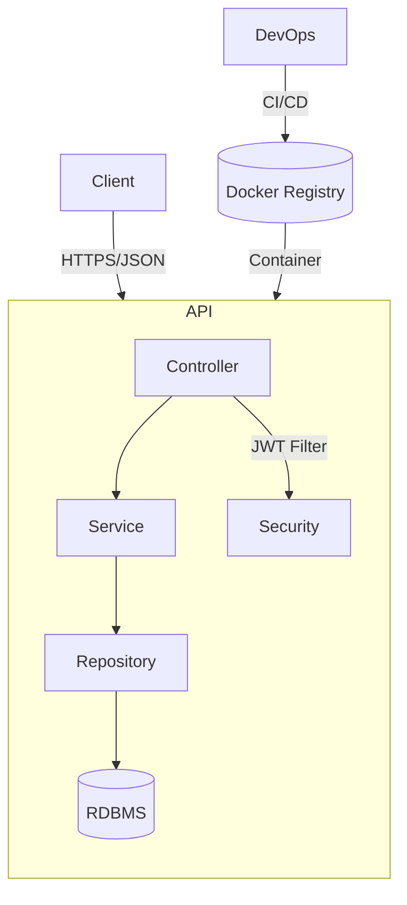
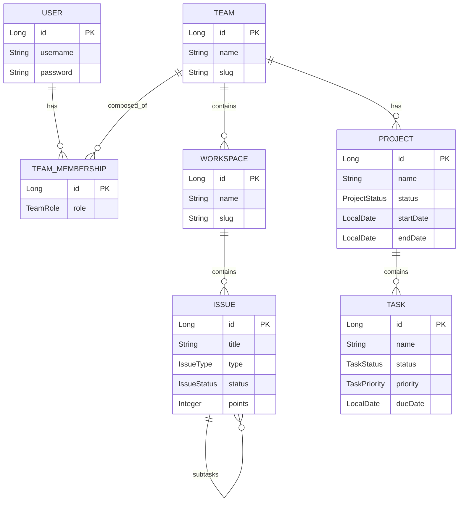
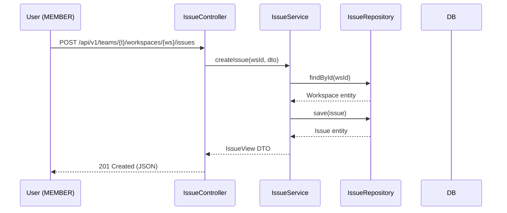
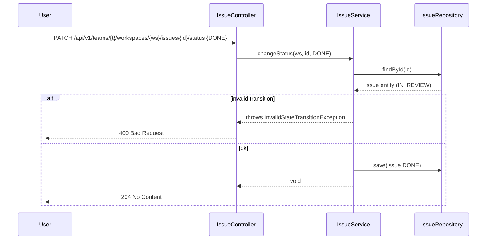

# Projective – Project-Management API

## 1. Vision & Scope
Projective is a multi-tenant, role-based REST API that lets organisations manage the full project lifecycle:

* Workspace-centric issue tracking
* Kanban-style task management for projects
* Team organisation with fine-grained roles
* JWT-secured, stateless access for web & mobile clients

The service is framework-agnostic on the client side; any SPA, mobile, or server application can consume it.

## 2. Stakeholders & Personas
* End-user: project contributor who needs to track tasks/issues
* Team admin: manages members, projects, workspaces
* Service admin (SRE/DevOps): manages global system concerns
* Product owner: wants metrics & reporting
* Developer: extends or integrates with the API

## 3. Functional Requirements
| ID | Requirement |
|----|-------------|
| FR-1 | Create / read / update / delete (CRUD) Workspaces, Projects, Tasks, Issues |
| FR-2 | Hierarchical Issues (parent-subtask) with constrained status transitions |
| FR-3 | Team membership with roles (`MEMBER`, `ADMIN`, `OWNER`) |
| FR-4 | JWT-based authentication; per-endpoint authorisation |
| FR-5 | Pagination & filtering (future work) |
| FR-6 | OpenAPI / Swagger documentation auto-generated |

## 4. Non-Functional Requirements
| ID | Category | Requirement / Metric |
|----|----------|----------------------|
| NFR-1 | Performance | <100 ms P95 latency for common endpoints under 200 RPS |
| NFR-2 | Security | OWASP Top-10 compliance, bcrypt-hashed passwords, JWT expiry |
| NFR-3 | Reliability | ACID guarantees via Spring TX; health endpoint; DB migrations planned |
| NFR-4 | Portability | Java 21, no proprietary database (defaults to H2; production targets Postgres) |
| NFR-5 | Extensibility | Clean layered architecture, DTO isolation |

## 5. High-Level Architecture



* Single stateless Spring Boot application
* Layered hexagonal style: Controller ↔ Service ↔ Repository ↔ JPA Entities
* Security layer (filters & interceptors) orthogonal to business flow
* Deployed in container / Kubernetes; supports horizontal scaling

## 6. Domain Model



### Enum-based Workflows
- Issue status: `TODO → IN_PROGRESS → IN_REVIEW → DONE`, with adjacency constraint enforced in code (see `IssueStatus.canTransitionTo`)
- Task & project status are simple stages without transition rules yet

## 7. Component View

1. Controller layer
   * REST mapping, validation, DTO ↔ entity mapping
   * `AuthController`, `TeamController`, `WorkspaceController`, `ProjectController`, `TaskController`, `IssueController`, `HealthController`
2. Service layer
   * Business rules, cross-entity consistency
   * Transactional boundaries (`@Transactional`)
3. Repository layer
   * Spring Data JPA interfaces
   * H2 in dev; schema auto-created via JPA; DB migrations (Flyway) planned
4. Security
   * `JwtAuthenticationFilter` extracts & validates token
   * `AuthzService` centralises RBAC checks (`UserRole` vs `TeamRole`)
   * `SecurityConfig` wires filter chain, CORS, BCrypt strength
5. Config & Infra
   * `application.properties` covers datasource, JWT, CORS
   * Profiles (`dev`, `prod`) can override secrets & DB URL

## 8. Sequence Examples

### 8.1  Creating an Issue



### 8.2  Changing Issue Status with Validation



## 9. Security Design
* `SignIn` and `SignUp` return signed JWT (HMAC-SHA256)
* Token contains `sub` (username). Roles are reloaded from the database on every request and attached as Spring Security authorities
* Additional per-team authorisation enforced in services by consulting `TeamMembership`
* BCrypt strength configurable (`app.security.bcrypt-strength`, default 12)
* `CorsConfig` whitelists origins via env var

## 10. API Surface (excerpt)

| Method | Path | Description | Auth | Request Body DTO | Response DTO |
|--------|------|-------------|------|------------------|--------------|
| POST | /api/v1/auth/sign-in | Issue JWT | None | AuthPayload.SignIn | AuthPayload.Token |
| GET | /api/v1/teams | List teams for current user | USER | - | List<TeamPayload.View> |
| POST | /api/v1/teams | Create team | USER | TeamPayload.Create | TeamPayload.View |
| GET | /api/v1/teams/{slug}/projects | List projects | MEMBER+ | - | List<ProjectPayload.View> |
| ... | ... | ... | ... | ... | ... |

Full OpenAPI spec is auto-served at `/api-docs` and `/swagger-ui/index.html`.

## 11. Persistence Strategy
* JPA/Hibernate generates DDL from entities on first run (dev)
* Production database migrations (e.g. Flyway/Liquibase) are on the roadmap
* Default DB: in-memory H2 for local dev; can switch to Postgres/MySQL by changing datasource URL

## 12. Error Handling
Centralised `RestExceptionHandler` maps custom exceptions to `ProblemDetails` style JSON with fields:
```json
{
  "timestamp": "...",
  "status": 404,
  "error": "Not Found",
  "message": "Workspace not found",
  "path": "/workspaces/999"
}
```

## 13. Testing Strategy
* Unit tests for services with Mockito (future work)
* Integration tests with Spring Boot Test, H2, RestAssured
* Smoke/health test wired to `/health` endpoint for uptime checks

## 14. Deployment & Ops
* Packaged as fat JAR or Docker image (`./mvnw spring-boot:build-image`)
* Env vars override secrets (`APP_JWT_SECRET`, `SPRING_DATASOURCE_*`)
* Health & metrics endpoints for Kubernetes liveness/readiness probes
